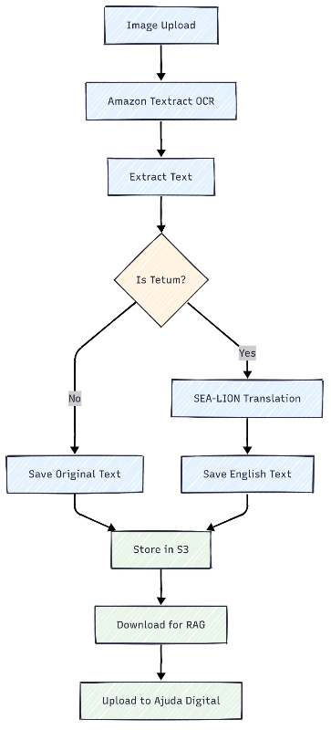

# 🚀 AJUDA DIGITAL

**Homegrown Government Chatbot by Timorese Youth**

[_Pan-SEA AI Developer Challenge 2025 - Public Sector Track_](https://seadeveloperchallenge.ai/)

---

## 🏆 **Project Overview**

**AJUDA DIGITAL** is a groundbreaking AI-powered government assistant that transforms how Timorese citizens access public services. Built by young Timorese developers, this innovative solution addresses critical barriers in government service delivery through intelligent, multilingual AI assistance.

### 🎯 **Problem Statement**

Citizens in Timor-Leste face significant challenges accessing government services:

❌ **Current Challenges:**

- **Complex bureaucracy** across multiple departments (Civil Registry, Business Registration, Immigration, etc.)
- **Language barriers** - Information primarily in Portuguese, not accessible to Tetum speakers
- **Physical office visits** required for basic information
- **Incomplete documentation** leading to rejections and wasted time
- **Complex government websites** that citizens cannot navigate effectively
- **Reliance on word-of-mouth** from friends and family for government information

### 💡 **Our Solution**

**AJUDA DIGITAL** provides **10 specialized AI assistants** covering every major government department:

✅ **Immediate Impact:**

- **Zero office visits** for information gathering
- **Native language support** in Tetum, Portuguese, and English
- **24/7 availability** - No more office hours limitations
- **Complete guidance** - Step-by-step procedures and document requirements
- **Instant answers** to complex government questions

### 🇹🇱 **Innovation & Impact**

- **🥇 Multi-Model Government Chatbot** made by young people for their country
- **🌟 Regional Leadership** - Demonstrates Timor-Leste youth can build cutting-edge AI solutions
- **🤝 Government Alignment** - Supports national AI implementation plans by 2026
- **🚀 ASEAN Readiness** - Positions Timor-Leste as a digital government leader in Southeast Asia

## 🎯 **Government Departments Covered**

**10 Specialized AI Models** for comprehensive government service coverage:

| **Department**                         | **Service Areas**                               | **Status**            |
| -------------------------------------- | ----------------------------------------------- | --------------------- |
| 🆔 **Civil Registry & Identity**       | Birth certificates, ID cards, citizenship       | ✅ **Available**      |
| ✈️ **Immigration & Travel**            | Passports, visas, travel documents              | ✅ **Available**      |
| 🏢 **Business & Commerce**             | Company registration, licenses, trade           | ✅ **Available**      |
| ⚖️ **Legal & Constitutional**          | Laws, rights, legal procedures                  | ✅ **Available**      |
| 🎓 **Education**                       | School enrollment, scholarships, certifications | 🔄 **In Development** |
| 🗳️ **Elections & Civic Participation** | Voting, civic duties, participation             | 🔄 **In Development** |
| 🏥 **Health & Social Services**        | Healthcare, social benefits, welfare            | 🔄 **In Development** |
| 💰 **Finance & Taxation**              | Taxes, financial services, payments             | 🔄 **In Development** |
| 🏞️ **Land & Property**                 | Land ownership, property registration           | 🔄 **In Development** |
| 💼 **Employment & Labor**              | Job services, labor rights, employment          | 🔄 **In Development** |

## 🔧 **Technical Implementation**

### 🤖 **Advanced AI Stack**

#### **Large Language Models (LLMs)**

- **[SEA-LION](https://api.sea-lion.ai/v1)** 🦁 - Primary LLM optimized for Southeast Asian languages and cultural context
- **[AWS Bedrock](https://docs.aws.amazon.com/bedrock/)** - Enterprise AI infrastructure with Claude and Titan models
- **Hybrid AI Architecture** - Best-of-breed models for different use cases

#### **Embedding & Vector Search**

- **Amazon Titan Text Embeddings G1** - 1,536-dimension embeddings for superior semantic search
- **PostgreSQL + pgvector** - Vector database for RAG (Retrieval-Augmented Generation)
- **RAG Implementation** - Context-aware responses using government document knowledge base

#### **Infrastructure & Deployment**

- **Amazon ECS with Fargate** - Serverless container orchestration
- **Amazon RDS PostgreSQL** - Managed database with Multi-AZ deployment
- **Amazon S3** - Document storage and file management
- **AWS Application Load Balancer** - High availability and traffic distribution

### 🌐 **System Architecture**

**Production Deployment:** Enterprise-grade AWS infrastructure with:

- **Auto-scaling** containers for high availability
- **Multi-AZ database** for data redundancy
- **CloudWatch monitoring** for system health
- **Security groups** for network protection

## 🌍 **Live Demonstration**

### 🚀 **Try Ajuda Digital Now**

**Main Application:** [**chat.ajuda-digital.com**](https://chat.ajuda-digital.com)

**Demo Credentials for Judges:**

- **Email:** `demo@ajudadigital.com`
- **Password:** `ajuda123A@`

_Or register with your own account_

**Showcase Website:** [**www.ajuda-digital.com**](https://www.ajuda-digital.com)

### 📊 **Available Datasets & RAG Knowledge Base**

**Current Data Sources:** [View Complete Dataset Collection](https://www.ajuda-digital.com/dataset)

#### **4 Active Models with Real Government Data:**

1. **🆔 Civil Registry & Identity Model**

   - Birth Certificate RDTL
   - Official government documents

2. **✈️ Immigration & Travel Model**

   - Common Passport procedures
   - Passport application process
   - Immigration Law 11-2017 LIA

3. **🏢 Business & Commerce Model**

   - Ministerial Diploma 33-2023
   - serve.gov.tl FAQ documentation

4. **⚖️ Legal & Constitutional Model**
   - Law 11-2017 LIA
   - RDTL Constitution (English)

#### **Data Collection Challenges & Innovation**

**Real-World Constraints:**

- **Limited government data access** - Bureaucratic barriers to comprehensive datasets
- **Time constraints** - Hackathon timeline limitations
- **Resource gathering** - Manual collection from websites, office boards, and public documents

**Our Solution:**

- **Multi-source data collection** - Photos of office notices, government websites, public PDFs
- **Community-driven approach** - [Data collection form](https://forms.gle/XEhRq9EVTcCBWCh1A) for citizen contributions
- **Automated processing pipeline** - AWS Textract + SEA-LION for document processing

## 📋 **Data Processing Pipeline**

### 🔄 **Document Processing System**

**Process:** [Manual Document Processing](Prosses-Data/README.MD)

1. **Image Collection** - Government documents, office boards, websites
2. **OCR Processing** - Amazon Textract for text extraction
3. **Language Processing** - SEA-LION for Tetum to English translation
4. **Categorization** - Automatic assignment to government departments
5. **RAG Integration** - Upload to vector database for semantic search

## 👥 **Team - Young Timorese Innovators**

**Built with ❤️ by young developers from Timor-Leste:**

### **Core Team** - [Team](https://www.ajuda-digital.com/team)

- **[Ajito Nelson Lucio da Costa](https://github.com/ajitonelsonn)** - Team Leader

- **[Jedinilda S. Seixas dos Reis](https://github.com/Jedinilda20)** - Team Member

- **[Abrao Glorito DC](https://github.com/abraog)** - Team Member

### **🏆 Team Achievements**

- **AI government chatbot** developed by Timorese youth
- **Regional innovation** representing Timor-Leste in Pan-SEA AI Challenge
- **Technical excellence** with enterprise-grade AWS deployment
- **Cultural impact** - Building for their own country's digital future

## 🔗 **Repository Structure**

### **📁 Project Components**

| **Component**             | **Description**              | **Repository**                                                        |
| ------------------------- | ---------------------------- | --------------------------------------------------------------------- |
| 🌐 **Showcase Website**   | Public information platform  | [ajuda-digital-website/](ajuda-digital-website/)                      |
| 💬 **Main Chatbot**       | AI assistant interface       | [Modified Open WebUI](open_webui_mod_doc/README.MD)                   |
| ☁️ **AWS Deployment**     | Production infrastructure    | [AWS Architecture](Ajuda-Digital-AWS-Production-Deployment/README.md) |
| 📊 **Data Processing**    | Document processing pipeline | [Data Processing](Prosses-Data/README.MD)                             |
| 📋 **Dataset Collection** | Government data sources      | [Dataset Status](https://www.ajuda-digital.com/dataset)               |

## 🚀 **Future Roadmap**

### **📈 Immediate Next Steps**

- **Complete remaining 6 models** - Education, Health, Finance, etc.
- **Enhanced data collection** - Government partnership for official datasets
- **Mobile application** - Native iOS/Android apps for better accessibility

### **🌟 Long-term Vision**

- **Government integration** - Official adoption as citizen service platform
- **Regional expansion** - Template for other Southeast Asian countries
- **Advanced AI features** - Voice interaction, document auto-completion
- **Citizen feedback integration** - Continuous improvement based on user data

### **🤝 Government Partnership Opportunities**

- **Official data access** - Partnership with government ministries
- **Digital transformation** - Supporting Timor-Leste's AI implementation goals
- **Training and capacity building** - Local expertise development

---

## 🏆 **Pan-SEA AI Challenge 2025**

---

**Made with ❤️ in Timor-Leste 🇹🇱**  
_"Building AI for our people, by our people"_
